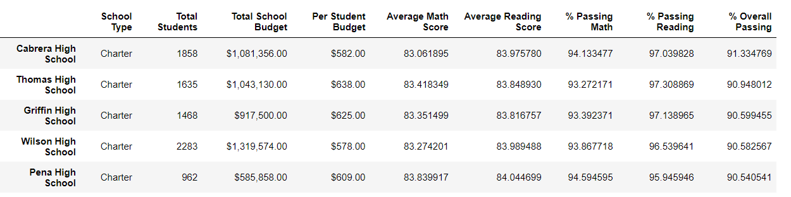

# School_District_Analysis
## Project Overview

We have been asked to sort out a series of requirements concerning analyzing various performance metrics of the different school districts and schools. Maria, our primary contact, has provided us with the following list:

Here is the list of deliverables for the analysis of the school district: 

- A high-level snapshot of the district's key metrics, presented in a table format
- An overview of the key metrics for each school, presented in a table format
- Tables presenting each of the following metrics:
  - Top 5 and bottom 5 performing schools, based on the overall passing rate
  - The average math score received by students in each grade level at each school
  - The average reading score received by students in each grade level at each school
  - School performance based on the budget per student
  - School performance based on the school size 
  - School performance based on the type of school

### How is the district summary affected?  &  How is the school summary affected?

Original
 

Updated
 

As we can see in the previous charts, there is no significant impact. The amount of students in grade 9th at Thomas High School is only 461 vs the total count 39,170 students.

### How does replacing the ninth graders’ math and reading scores affect Thomas High School’s performance relative to the other schools?

Original
 

Updated
 

As we can see in the previous charts, there is no significant impact. Even though the average math, reading, and overall score in Thomas High Scholl ere impacted was not enough to change its place in the top ranking

### How does replacing the ninth-grade scores affect the following:

- Math and reading scores by grade
Nan, which is granted to grade 9 students at Thomas High School instead of a grade in math and reading, is the only score altered in this DataFrame.

If we calculated the total or mean of the DataFrame, we would see a change between the original and updated DataFrame. 

- Scores by school spending
A small difference is notice in the scores by spending groups in the $630-$644 bin,which includes Thomas High School. 

- Scores by school size
The results for schools with a medium size (1000-2000) changed somewhat because of Thomas High School, which has 1,635 students, was included in this group.

- Scores by school type
Because Thomas High School is a Charter type school, the cahgnes affected only the charter schools, but no changes in the District type school scores because Thomas High School is not part of that group. 

## Summary
Above all the results after updating the file, we can determine that the changes for the four categories (Math and reading scores by grade, Scores by school spending, Scores by school size, Scores by school type) were slightly affected. This is related to the size of Thomas High School, which doesnt affect due the size of the dataset.
